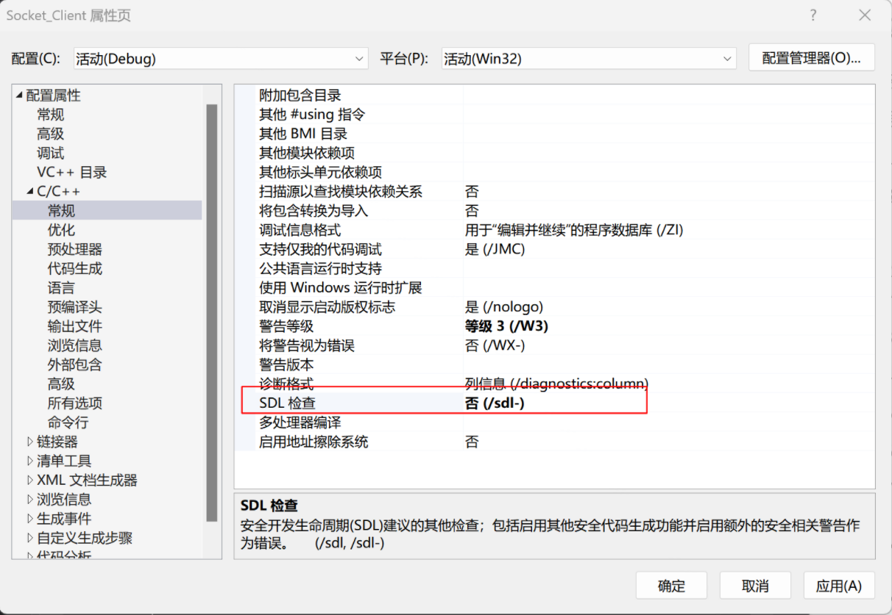
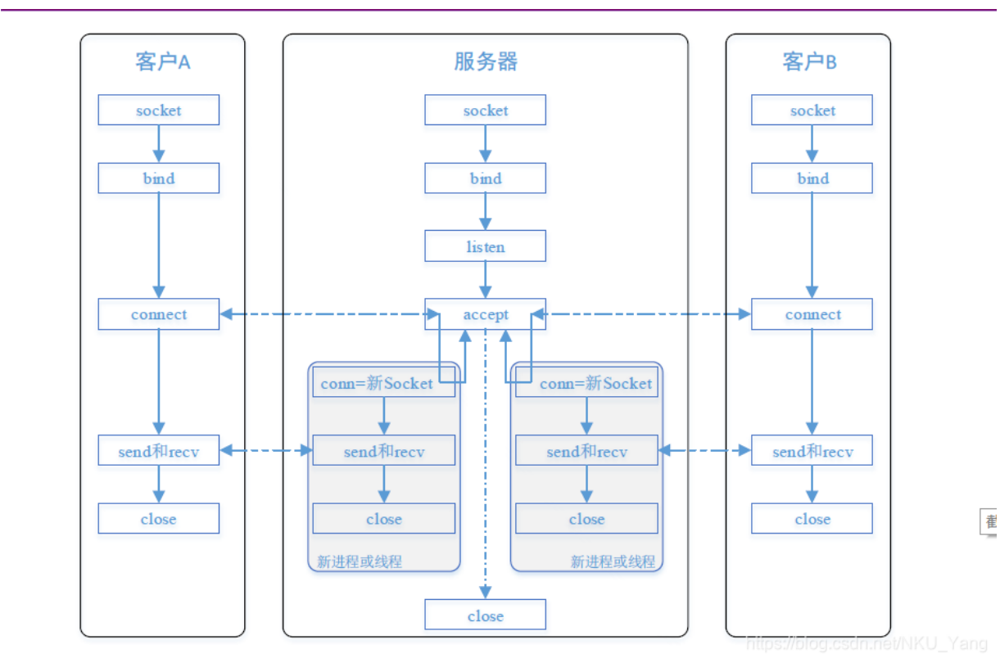
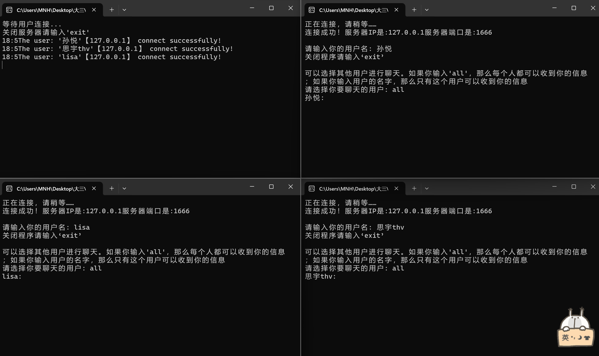
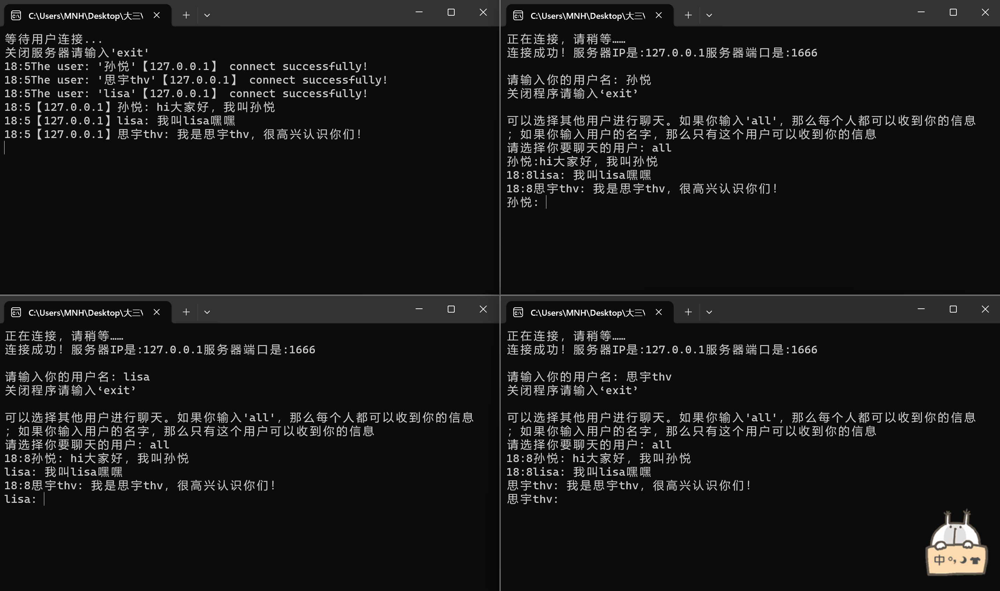
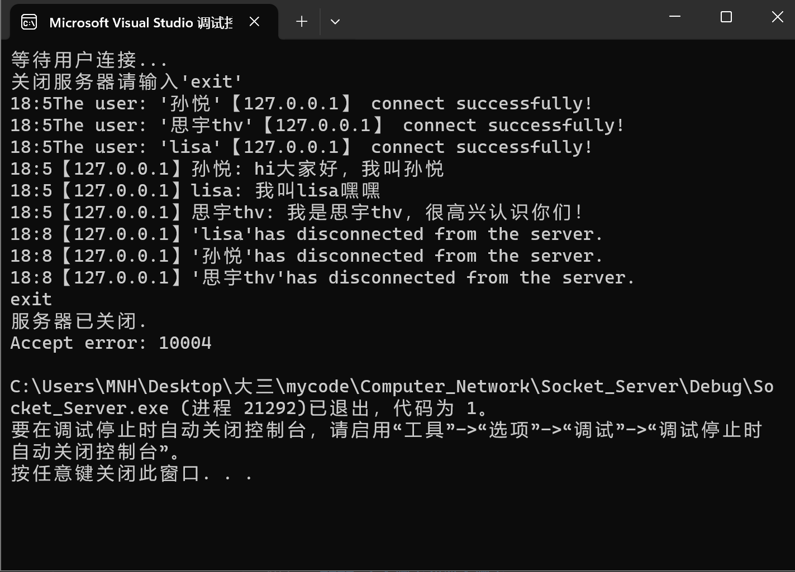
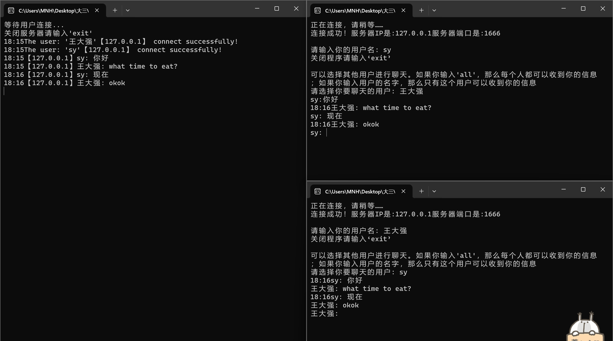
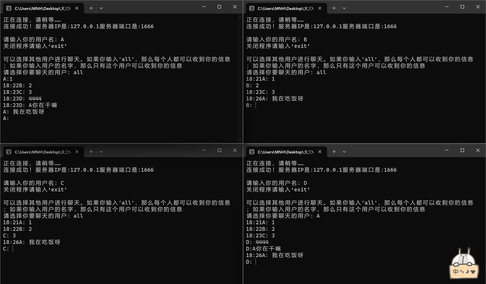
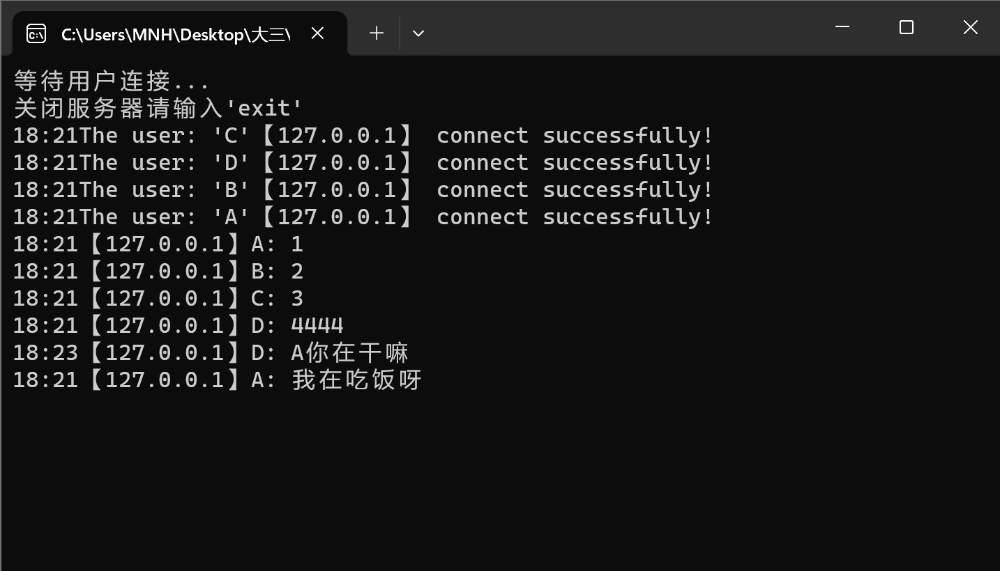

# 计算机网络实验报告

姓名：孙悦

学号：2110052

专业：物联网工程
<!-- TOC -->
- [计算机网络实验报告](#计算机网络实验报告)
  - [实验一：利用Socket编写一个聊天程序](#实验一利用socket编写一个聊天程序)
    - [实验要求：](#实验要求)
    - [一、前期准备](#一前期准备)
      - [相关知识学习：](#相关知识学习)
      - [环境配置：](#环境配置)
    - [二、协议设计](#二协议设计)
      - [程序参考流程：](#程序参考流程)
      - [协议设计如下：](#协议设计如下)
    - [三、实验过程](#三实验过程)
      - [服务器Server](#服务器server)
        - [全局变量](#全局变量)
        - [客户端结构体](#客户端结构体)
        - [发送数据线程](#发送数据线程)
        - [接受数据线程](#接受数据线程)
        - [接收请求线程](#接收请求线程)
        - [main函数](#main函数)
      - [客户端Client](#客户端client)
        - [全局变量](#全局变量-1)
        - [接收数据线程](#接收数据线程)
        - [main函数](#main函数-1)
    - [四、结果展示](#四结果展示)
        - [多人聊天](#多人聊天)
      - [多人聊天和双人聊天](#多人聊天和双人聊天)
## 实验一：利用Socket编写一个聊天程序

### 实验要求：

（1）给出你聊天协议的完整说明。

（2）利用C或C++语言，使用基本的Socket函数完成程序。不允许使用CSocket等封装后的类编写程序。

（3）使用流式套接字、采用多线程（或多进程）方式完成程序。

（4）程序应有基本的对话界面，但可以不是图形界面。程序应有正常的退出方式。

（5）完成的程序应能支持多人聊天，支持英文和中文聊天。

（6）编写的程序应该结构清晰，具有较好的可读性。

（7）在实验中观察是否有数据的丢失，提交源码和实验报告。

### 一、前期准备

#### 相关知识学习：

- **套接字：**
1. 进程通过套接字发送消息和接收消息。

2. 流式套接字：使用TCP协议，支持主机之间面向连接的、顺序的、可靠的、全双工字节流传输
- **网络协议：**
1. 计算机网络中，各个实体之间的数据交换必须遵守事先约定好的规则，这些规则就称为协议。

2. 网络协议的组成要素：
   
   语法：数据与控制信息的结构或格式
   
   语义：需要发出何种控制信息，完成哪些动作以及做出何种响应
   
   时序：事件实现顺序的详细说明

#### 环境配置：

- **将SDL检查设置为否**

### 二、协议设计
#### 程序参考流程：



#### 协议设计如下：

我们实现了一个多人聊天室，支持双人聊天

1. 采用流式套接字和TCP协议，使用多线程。

2. 程序包括客户端和服务器端，要求只有服务器端在线时，客户端才可以与之相连，否则连接失败。

3. 服务器端支持与多个客户端相连，并设置最大连接数10。当超过最大连接数10时，服务器不支持连接。
   
   - 服务器对每个连接的客户端分配一个线程，并用一个新SOCKET与该客户端进行通信；
   
   - 服务器的每个线程接收它所负责客户端的消息，发送给其他客户端并打印到日志信息；
   
   - 服务器实时检测客户端是否断开连接，若断开连接，则及时释放与该客户端的连接资源；
   
   - 若此时服务器的最大连接数未满，则支持再与新的客户端建连。

4. 客户端与服务器端建立连接使用到两个线程：
   
   - 主线程负责键入要发送的消息并发送（ThreadSend）给服务器端再开一个线程接收（ThreadRecv）从服务器端发来的消息，并打印
5. 当客户端选择all时，所有在线用户都可以收到消息；当客户端A只选择客户端B且客户端B也选择客户端A时，则两人可以互相通信；若客户端A选择B，但客户B选择all，所有人都能收到B的消息，A的消息只能B收到。
6. 客户端实时检测是否与服务器建连，当recv异常，则连接断开，关闭SOCKET允许客户端自行关闭：当用户输入 exit，则连接断开，关闭SOCKET和聊天室  

### 三、实验过程
#### 服务器Server
具体功能实现和核心代码讲解见注释
##### 全局变量
```C++
#define SEND_OVER 1							 //消息已转发
#define SEND_YET  0							 //消息未转发
int i = 0;//跟踪在线客户端的数量
int Status = SEND_YET;//信息发送状态，初始为未转发

SOCKET ServerSocket = INVALID_SOCKET;		 //服务端套接字，接受客户端的连接
                                             //=INVALID_SOCKET 表示服务器套接字尚未被有效地初始化。
SOCKADDR_IN ClientAddr = { 0 };			 //客户端地址
int ClientAddrLen = sizeof(ClientAddr);//客户端地址长度

bool CheckConnect = false;                //检查连接情况
HANDLE HandleRecv[10] = { NULL };				 //数组，存储线程句柄，每个句柄对应一个客户端的接收线程
HANDLE mainHandle;							 //用于accept的线程句柄（用于处理接受客户端连接请求的线程）
```
##### 客户端结构体
```c++
typedef struct _Client
{
	SOCKET sClient;      //客户端套接字
	char buffer[128];		 //数据缓冲区
	char userName[16];   //客户端用户名
	char identify[16];   //用于标识转发的范围
	char IP[20];		 //客户端IP
	UINT_PTR flag;       //标记客户端，用来区分不同的客户端
} Client;
Client insideClient[10] = { 0 };                  //创建一个客户端结构体,最多同时10人在线
```
##### 发送数据线程
```c++
unsigned __stdcall ThreadSend(void* param)
{
	int error = 0;
	int flag = *(int*)param;//将传递给线程的参数 param 转换为整数，并将其赋值给 flag。flag 表示要发送消息的客户端的标志
	SOCKET client = INVALID_SOCKET;					//创建一个临时套接字来存放要转发的客户端套接字
	char temp[128] = { 0 };							//创建一个临时的数据缓冲区，用来存放接收到的数据
	memcpy(temp, insideClient[flag].buffer, sizeof(temp));//将 insideClient[flag].buffer 中的消息复制到 temp 中，以备后续修改和发送。
	sprintf_s(insideClient[flag].buffer, "%s: %s", insideClient[flag].userName, temp); //把发送源的名字添进转发的信息里
	if (strlen(temp) != 0 && Status == SEND_YET) //如果数据不为空且还没转发则转发
	{
		if (strcmp(insideClient[flag].identify, "all") == 0)//如果是all就转发给其他所有人
		{
			for (int j = 0; j < i; j++) {
				if (j != flag) {//向除自己之外的所有客户端发送信息
					error = send(insideClient[j].sClient, insideClient[flag].buffer, sizeof(insideClient[j].buffer), 0);
					if (error == SOCKET_ERROR)
						return 1;
				}
			}
		}
		else//否则发给指定的那个人
		{
			for (int j = 0; j < i; j++)
				if (strcmp(insideClient[j].userName, insideClient[flag].identify) == 0)
				{
					error = send(insideClient[j].sClient, insideClient[flag].buffer, sizeof(insideClient[j].buffer), 0);
					if (error == SOCKET_ERROR)
						return 1;
				}
		}
	}

	Status = SEND_OVER;   //转发成功后设置状态为已转发
	return 0;
}
```
##### 接受数据线程
```c++
unsigned __stdcall ThreadRecv(void* param)
{

	SOCKET client = INVALID_SOCKET;
	int flag = 0;//标记要处理的客户端的索引
	for (int j = 0; j < i; j++) {
		if (*(int*)param == insideClient[j].flag)            //判断是为哪个客户端开辟的接收数据线程
		{
			client = insideClient[j].sClient;
			flag = j;
		}
	}
	char temp[128] = { 0 };  //临时数据缓冲区
	while (true)//该循环用于不断接收来自客户端的消息
	{
		// 获取当前时间
		time_t now = time(0);
		// 转换为本地时间
		tm* ltm = localtime(&now);

		memset(temp, 0, sizeof(temp));//将 temp 数组的内容全部初始化为零，以确保缓冲区为空。
		int error = recv(client, temp, sizeof(temp), 0); //接收数据
		if (error == SOCKET_ERROR)
			continue;
		Status = SEND_YET;	//设置转发状态为未转发
		memcpy(insideClient[flag].buffer, temp, sizeof(insideClient[flag].buffer));/*将接收到的消息从 temp 缓冲区复制到
																				   相应客户端的消息缓冲区 insideClient[flag].buffer 中*/
		if (strcmp(temp, "exit") == 0)   //判断如果客户发送exit请求，那么直接关闭线程，不打开转发线程
		{
			closesocket(insideClient[flag].sClient);//关闭该套接字
			CloseHandle(HandleRecv[flag]); //这里关闭了线程句柄
			insideClient[flag].sClient = 0;  //把这个位置空出来，留给以后进入的线程使用
			HandleRecv[flag] = NULL;
			//用printf来取参数
			cout << ltm->tm_hour << ":" << ltm->tm_min<<  "【" <<insideClient[flag].IP << "】" << "'" << insideClient[flag].userName<< "'" << "has disconnected from the server. " << endl;
		}
		else
		{
			cout << ltm->tm_hour << ":" << ltm->tm_min << "【" << insideClient[flag].IP << "】" << insideClient[flag].userName << ": " << temp << endl;
			_beginthreadex(NULL, 0, ThreadSend, &flag, 0, NULL); //开启一个转发线程,flag标记着这个需要被转发的信息是从哪个线程来的；
		}
	}
	return 0;
}
```
##### 接收请求线程
```c++
unsigned __stdcall MainAccept(void* param)
{
	int flag[10] = { 0 };
	while (true)//监听和接收客户端的连接请求
	{
		if (insideClient[i].flag != 0)   //找到从前往后第一次没被连接的insideClient
		{
			i++;
			continue;
		}
		//如果有客户端申请连接就接受连接
		if ((insideClient[i].sClient = accept(ServerSocket, (SOCKADDR*)&ClientAddr, &ClientAddrLen)) == INVALID_SOCKET)
		{
			cout << "Accept error: " << WSAGetLastError() << endl;
			closesocket(ServerSocket);
			WSACleanup();
			return -1;
		}
		else if (i > 10) {
			cout << "连接失败，人数已超上限！" << endl;
			closesocket(ServerSocket);
			WSACleanup();
			return -1;
		}
		recv(insideClient[i].sClient, insideClient[i].userName, sizeof(insideClient[i].userName), 0); //接收用户名
		recv(insideClient[i].sClient, insideClient[i].identify, sizeof(insideClient[i].identify), 0); //接收转发的范围
		
		memcpy(insideClient[i].IP, inet_ntoa(ClientAddr.sin_addr), sizeof(insideClient[i].IP)); //记录客户端IP

		// 获取当前时间
		time_t now = time(0);
		// 转换为本地时间
		tm* ltm = localtime(&now);

		cout << ltm->tm_hour << ":" << ltm->tm_min<< "The user: '" << insideClient[i].userName << "'" << "【" << insideClient[i].IP << "】"  << " connect successfully!"  << endl;
		//memcpy(insideClient[i].IP, inet_ntoa(ClientAddr.sin_addr), sizeof(insideClient[i].IP)); //记录客户端IP
		insideClient[i].flag = insideClient[i].sClient; //不同的socke有不同UINT_PTR类型的数字来标识
		i++;    //如果去掉这个最开始的赋值会报错
		for (int j = 0; j < i; j++)
		{
			if (insideClient[j].flag != flag[j])
			{
				if (HandleRecv[j])   //如果那个句柄已经被清零了，那么那就关掉那个句柄
					CloseHandle(HandleRecv[j]);
				HandleRecv[j] = (HANDLE)_beginthreadex(NULL, 0, ThreadRecv, &insideClient[j].flag, 0, NULL); //开启接收消息的线程
			}
		}

		for (int j = 0; j < i; j++)
		{
			flag[j] = insideClient[j].flag;//防止ThreadRecv线程多次开启
		}
		Sleep(3000);
	}
	return 0;
}
```
##### main函数
```c++
int main()
{
	WSADATA wsaData = { 0 };

	//初始化套接字
	//指定要使用的 Winsock 版本2.2
	if (WSAStartup(MAKEWORD(2, 2), &wsaData))
	{
		cout << "WSAStartup error: " << WSAGetLastError() << endl;
		return -1;
	}

	//创建套接字
	ServerSocket = socket(AF_INET, SOCK_STREAM, IPPROTO_TCP);
	if (ServerSocket == INVALID_SOCKET)
	{
		cout << "Socket error: " << WSAGetLastError() << endl;
		return -1;
	}

	SOCKADDR_IN ServerAddr = { 0 };				//服务端地址
	USHORT uPort = 1666;						//服务器监听端口
	//设置服务器地址
	ServerAddr.sin_family = AF_INET;//连接方式
	ServerAddr.sin_port = htons(uPort);//服务器监听端口
	ServerAddr.sin_addr.S_un.S_addr = htonl(INADDR_ANY);//任何客户端都能连接这个服务器

	//绑定服务器
	if (SOCKET_ERROR == bind(ServerSocket, (SOCKADDR*)&ServerAddr, sizeof(ServerAddr)))
	{
		cout << "Bind error: " << WSAGetLastError() << endl;
		closesocket(ServerSocket);
		return -1;
	}

	//设置监听客户端连接数
	if (SOCKET_ERROR == listen(ServerSocket, 20))
	{
		cout << "Listen error: " << WSAGetLastError() << endl;
		closesocket(ServerSocket);
		WSACleanup();
		return -1;
	}

	cout << "等待用户连接..." << endl;
	mainHandle = (HANDLE)_beginthreadex(NULL, 0, MainAccept, NULL, 0, 0);   //mainHandle是连接其他client的主要线程
	char Serversignal[10];
	cout << "关闭服务器请输入'exit' " << endl;
	while (true)
	{
		cin.getline(Serversignal, 10);
		if (strcmp(Serversignal, "exit") == 0)
		{
			cout << "服务器已关闭. " << endl;
			CloseHandle(mainHandle);
			for (int j = 0; j < i; j++) //依次关闭套接字
			{
				if (insideClient[j].sClient != INVALID_SOCKET)
					closesocket(insideClient[j].sClient);
			}
			closesocket(ServerSocket);
			WSACleanup();
			exit(1);
			return 1;
		}
	}
	return 0;
}
```


#### 客户端Client
##### 全局变量
```c++
#define RECV_OVER 1    //已收到
#define RECV_YET 0     //还没收到
char userName[16] = { 0 };
boolean isPrint = false;  // 判断是否要在客户端打印名字
int cStatus = RECV_YET;
```
##### 接收数据线程
```c++
unsigned __stdcall ThreadRecv(void* param)
{
	char bufferRecv[128] = { 0 };
	while (true)
	{
		int error = recv(*(SOCKET*)param, bufferRecv, sizeof(bufferRecv), 0);
		if (error == SOCKET_ERROR)
		{
			Sleep(500);
			continue;
		}
		if (strlen(bufferRecv) != 0)
		{
			// 获取当前时间
			time_t now = time(0);
			// 转换为本地时间
			tm* ltm = localtime(&now);

			if (isPrint)
			{
				for (unsigned int i = 0; i <= strlen(userName) + 2; i++)
					cout << "\b";
				cout << ltm->tm_hour << ":" << ltm->tm_min <<bufferRecv << endl;
				
				cout << userName << ": ";   //因为这是在用户的send态时，把本来打印出来的userName给退回去了，所以收到以后需要再把userName打印出来
				cStatus = RECV_OVER;
			}
			else
				cout << ltm->tm_hour << ":" << ltm->tm_min << bufferRecv << endl;
		}
		else
			Sleep(100);
	}
	return 0;
}
```
##### main函数
```c++
int main()
{

	WSADATA wsaData = { 0 };//存放套接字信息
	SOCKET ClientSocket = INVALID_SOCKET;//客户端套接字
	SOCKADDR_IN ServerAddr = { 0 };//服务端地址
	USHORT uPort = 1666;//服务端端口
						 //初始化套接字
	if (WSAStartup(MAKEWORD(2, 2), &wsaData))//将库文件和程序绑定
	{
		cout << "WSAStartup error: " << WSAGetLastError() << endl;
		return -1;
	}

	//创建套接字
	ClientSocket = socket(AF_INET, SOCK_STREAM, IPPROTO_TCP);
	if (ClientSocket == INVALID_SOCKET)
	{
		cout << "Socket error: " << WSAGetLastError() << endl;
		return -1;
	}

	//设置服务器地址
	ServerAddr.sin_family = AF_INET;
	ServerAddr.sin_port = htons(uPort);//服务器端口
	ServerAddr.sin_addr.S_un.S_addr = inet_addr("127.0.0.1");//服务器地址

	cout << "正在连接，请稍等……" << endl;

	//连接服务器
	if (SOCKET_ERROR == connect(ClientSocket, (SOCKADDR*)&ServerAddr, sizeof(ServerAddr)))
	{
		cout << "Connect error: " << WSAGetLastError() << endl;
		closesocket(ClientSocket);
		WSACleanup();
		return -1;
	}

	cout << "连接成功！" << "服务器IP是:" << inet_ntoa(ServerAddr.sin_addr);
	cout << "服务器端口是:" << htons(ServerAddr.sin_port) << endl << endl;
	cout << "请输入你的用户名: ";

	cin.getline(userName, 16);
	cout << "关闭程序请输入‘exit’ " << endl;
	send(ClientSocket, userName, sizeof(userName), 0);
	cout << endl;

	char identify[16] = { 0 };
	cout << "可以选择其他用户进行聊天。如果你输入'all'，那么每个人都可以收到你的信息；如果你输入用户的名字，那么只有这个用户可以收到你的信息 " << endl;
	cout << "请选择你要聊天的用户: ";
	cin.getline(identify, 16);
	send(ClientSocket, identify, sizeof(identify), 0);

	_beginthreadex(NULL, 0, ThreadRecv, &ClientSocket, 0, NULL); //启动接收线程

	char bufferSend[128] = { 0 };

	while (1)
	{
		if (isPrint == false)
		{
			cout << userName << ":";
			isPrint = true;
		}
		cin.getline(bufferSend, 128);
		if (strcmp(bufferSend, "exit") == 0)
		{
			cout << "正在退出..." << endl;
			Sleep(2000);
			int error = send(ClientSocket, bufferSend, sizeof(bufferSend), 0);
			if (error == SOCKET_ERROR)
				return -1;    //退出当前线程
			return 0;   //线程会关闭
		}

		int error = send(ClientSocket, bufferSend, sizeof(bufferSend), 0);
		if (error == SOCKET_ERROR)
			return -1;    //退出当前线程
		if (error != 0)
		{
			isPrint = false;
		}
	}
	for (int k = 0; k < 1000; k++)    //让主线程一直转
		Sleep(10000000);

	closesocket(ClientSocket);
	WSACleanup();
	return 0;
}
```
### 四、结果展示

##### 多人聊天
- 先打开服务器，然后打开三个客户端并命名然后选择all
  - 可以看到服务器记录每个用户连接成功的日志，日志包含连接时间和用户端地址和用户名
  - 用户端连接成功后打印服务器的IP和端口号
  
- 进行多人聊天
  - 服务器记录每个用户消息的日志（时间，IP，用户名，消息内容）。
  - 输入内容然后回车即可发送，用户端可以收到群聊中其他人的消息（带时间和用户名），支持中英文聊天。
  
- 客户端和服务器依次关闭，均输入exit退出，服务器关闭后不再接受连接
  
#### 多人聊天和双人聊天
- 只有两个人的聊天，可以选择all或者对方用户名

- 群聊混着单聊
  一个服务器，四个用户，三个人ABC选择all处在群聊中，D选择A，这种D能收到ABC的消息，但是只有A能收到D的消息
  
  


