# 计算机网络实验报告

姓名：孙悦

学号：2110052

专业：物联网工程

## 实验二：配置Web服务器，编写简单页面，分析交互过程

### 实验要求

（1） 搭建Web服务器（自由选择系统），并制作简单的Web页面，包含简单文本信息（至少包含专业、学号、姓名）、自己的LOGO、自我介绍的音频信息。页面不要太复杂，包含要求的基本信息即可。

（2） 通过浏览器获取自己编写的Web页面，使用Wireshark捕获浏览器与Web服务器的交互过程，并进行简单的分析说明。

（3） 使用HTTP，不要使用HTTPS。

（4） 提交实验报告。

### 一、Web服务器搭建

控制面板-程序-启用或关闭Windows功能-Internet Information Services
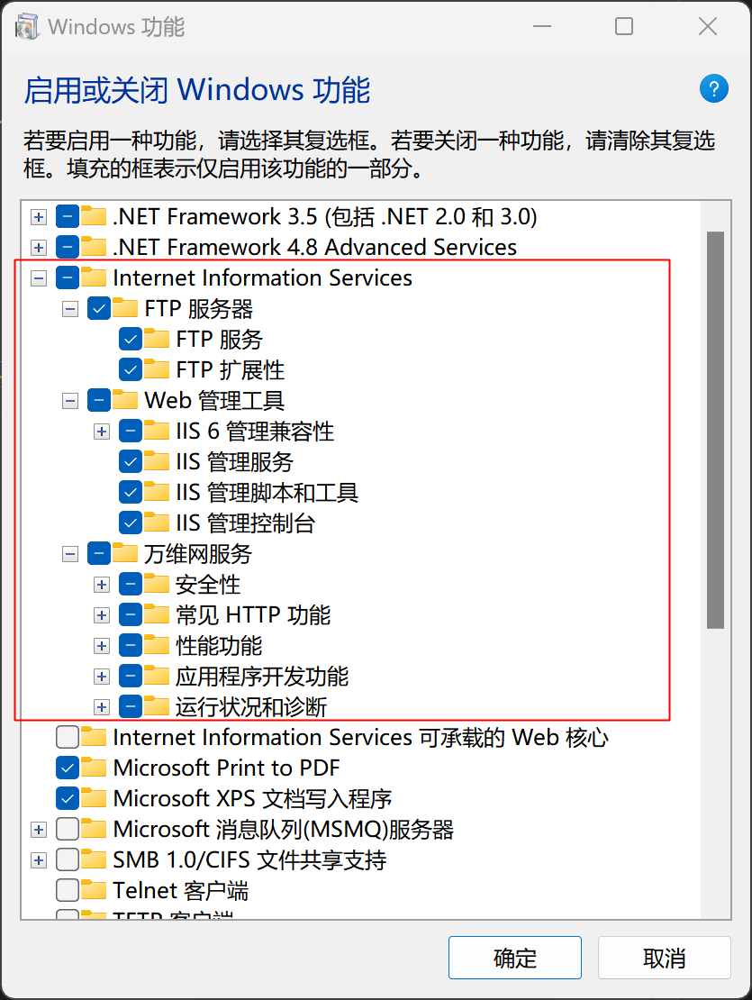

然后就会有Internet Information Services （IIS）管理器（记得关闭防火墙）
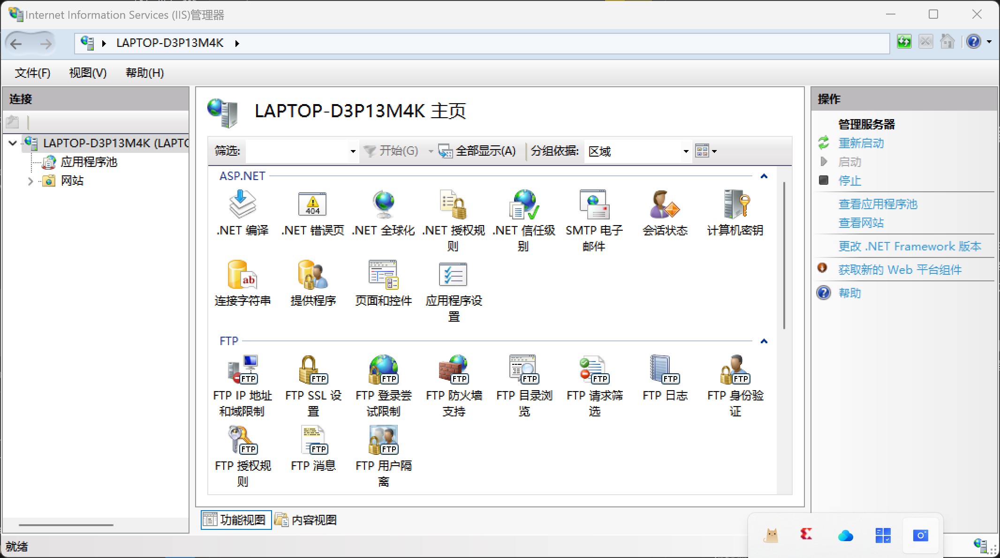

然后添加网站（这个是第一次尝试）
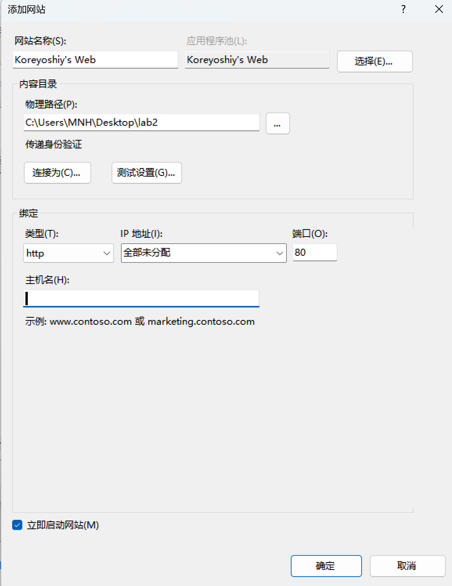

我的网站最终信息为：其中端口号为**90**
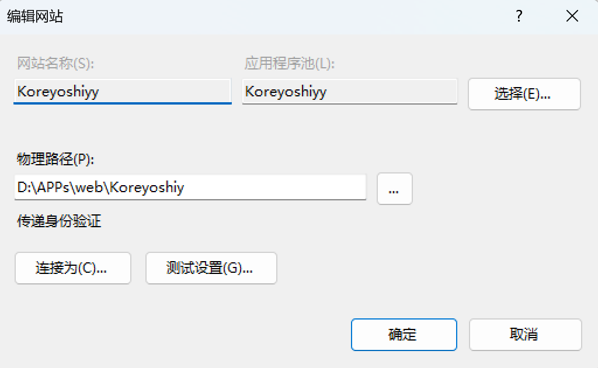

打开应用程序池，选择我的网站koreyoshiy，点击右侧“设置应用程序池默认设置”选项，设置.NET CLR版本选择v2.0版本，启动32位应用程序改为true
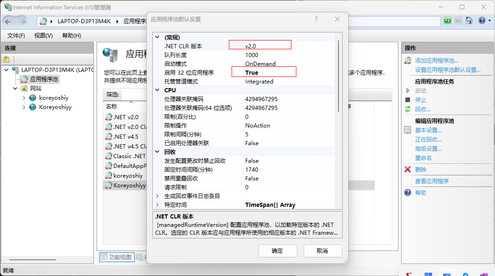

然后双击自己添加的网站，选择IIS下的ASP选项。启用父路径选择true，然后应用
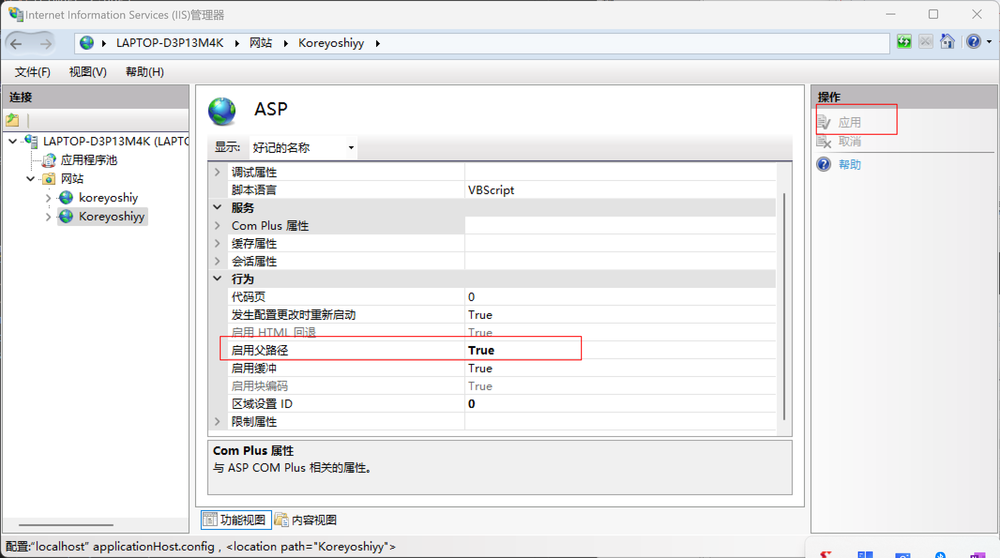

至此就搭建成功了Web服务器。

### 二、制作简单Web页面

在上一步搭建web服务器设置的位置D:\APPs\web\Koreyoshiy,在这个目录下，新建一个index.html，网页要添加的logo图片和音频也放在这个目录下
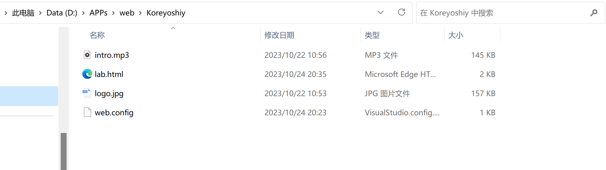

lab.html内容如下：

```html
<!DOCTYPE html>
<html>
<head>
    <meta charset="UTF-8">
    <title>lab2</title>
    <style>
        .content {
            text-align: center; /* 水平居中对齐内容 */
        }
        .personal-info {
            text-align: center; /* 水平居中对齐个人信息 */
            font-size: 18px; /* 设置字体大小 */
        }

        img {
            max-width: 20%; /* 图像最大宽度为100% */
            display: block; /* 使图像居中显示 */
            margin: 0 auto; /* 水平居中图像 */
        }

        audio {
            display: block; /* 使音频元素居中显示 */
            margin: 20px auto; /* 上下居中音频元素，并添加一些上边距 */
        }
    </style>
</head>
<body>
    <div class="content">
        <div class="personal-info">
            <h1>个人信息</h1>
            <p>专业：物联网工程</p>
            <p>学号：2110052</p>
            <p>姓名：孙悦</p>
        </div>
        
        <audio controls>
            <source src="intro.mp3" type="audio/mpeg">
            Your browser does not support the audio element.
        </audio>

    </div>
</body>
</html>
```

然后网页效果如下：
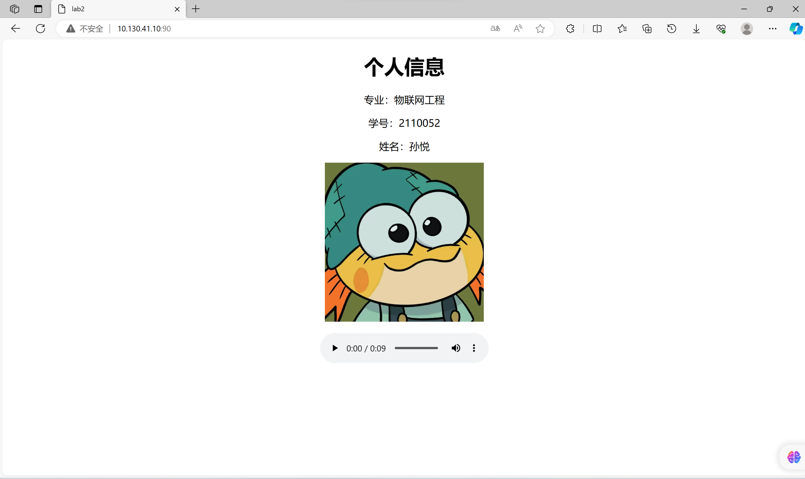

### 三、Wireshark捕捉

1. 开启 wireshark 软件，本机作为客户端去访问本机作为服务器搭建的网站，因此是一个loopback，选择 Adapter for lookback traffic capture：

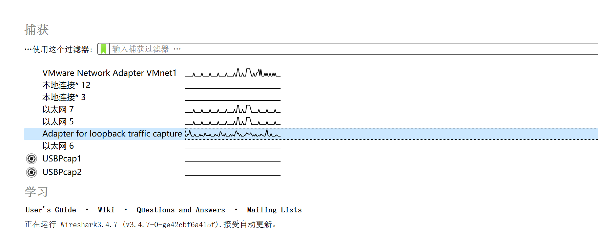

2. 开启抓包，然后浏览器里浏览自己做的网页http://10.130.41.10:90（或者直接输入localhost）


3. 抓包页面如下
   
   使用tcp.port==90 and ip.addr==10.130.41.10进行过滤
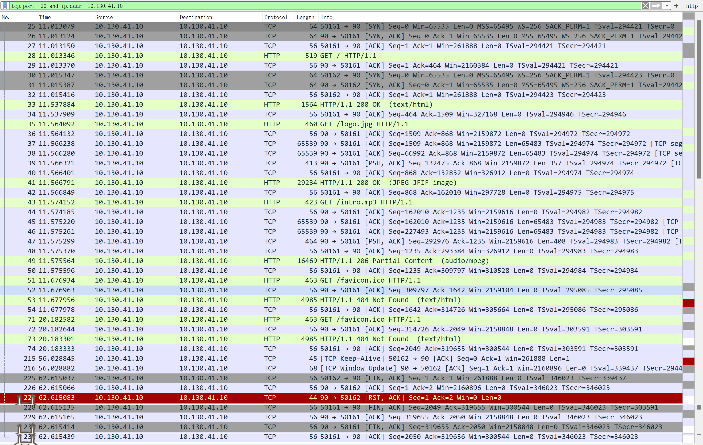
### 四、抓包分析

(1) TCP三次握手建立连接

使用 TCP 协议进行通信的双方必须先建立连接，然后才能开始传输数据。为了确保连接双方可靠性，在双方建立连接时，TCP 协议采用了三次握手策略。客户端和通讯端要进行连接，要确认双方的收发能力都是正常的
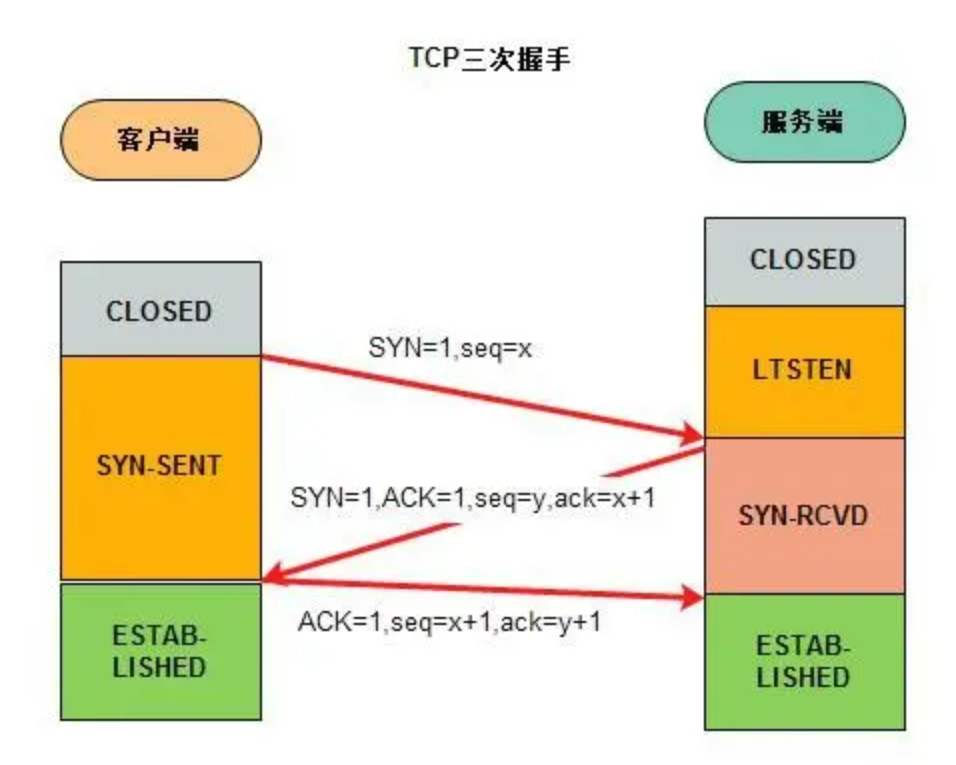
框住的是三次握手：
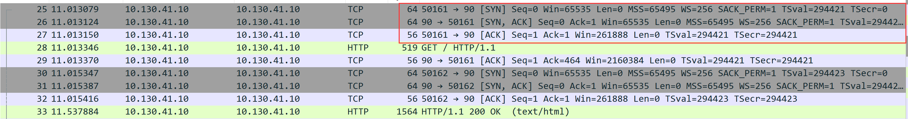
1. 第一次握手:

   第一次握手([SYN], Seq = x) 客户端发送一个SYN标记的包，Seq初始序列号x，发送完成后客户端进入SYN_SEND状态。

   客户端主动连接服务端，可以看到传输控制协议里序列号Seq=0，代表初次连接，确认码Ack=0，SYN=1的标志位表示请求建立连接。
   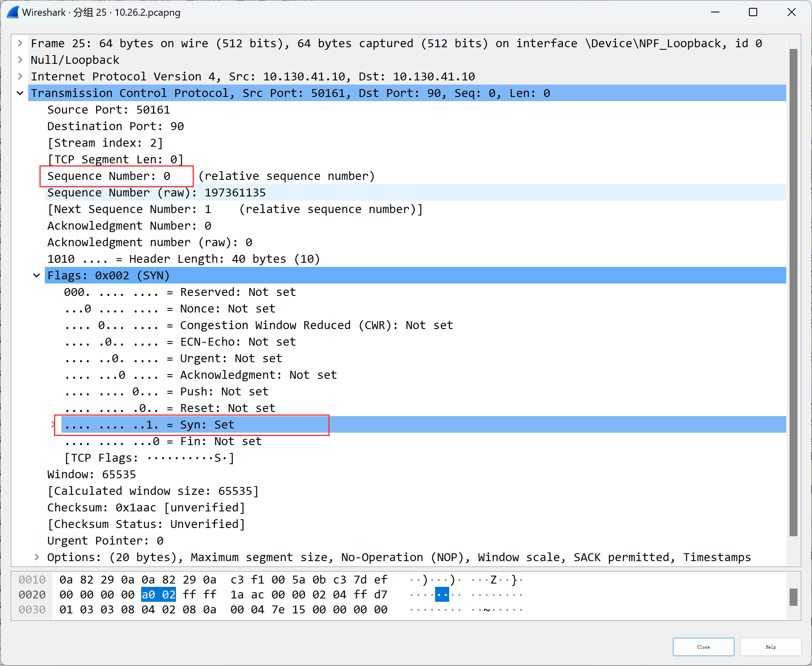
   
2. 第二次握手
   
   第二次握手([SYN,ACK], Seq = y, ACK = x + 1)
   服务器返回确认包(ACK)应答，同时还要发送一个SYN包回去。ACK = x + 1,表示确认收到(客户端发来的Seq值 + 1)，Seq = y, 表示让客户端确认是否能收到。发送完成后服务端进入SYN_RCVD状态。
   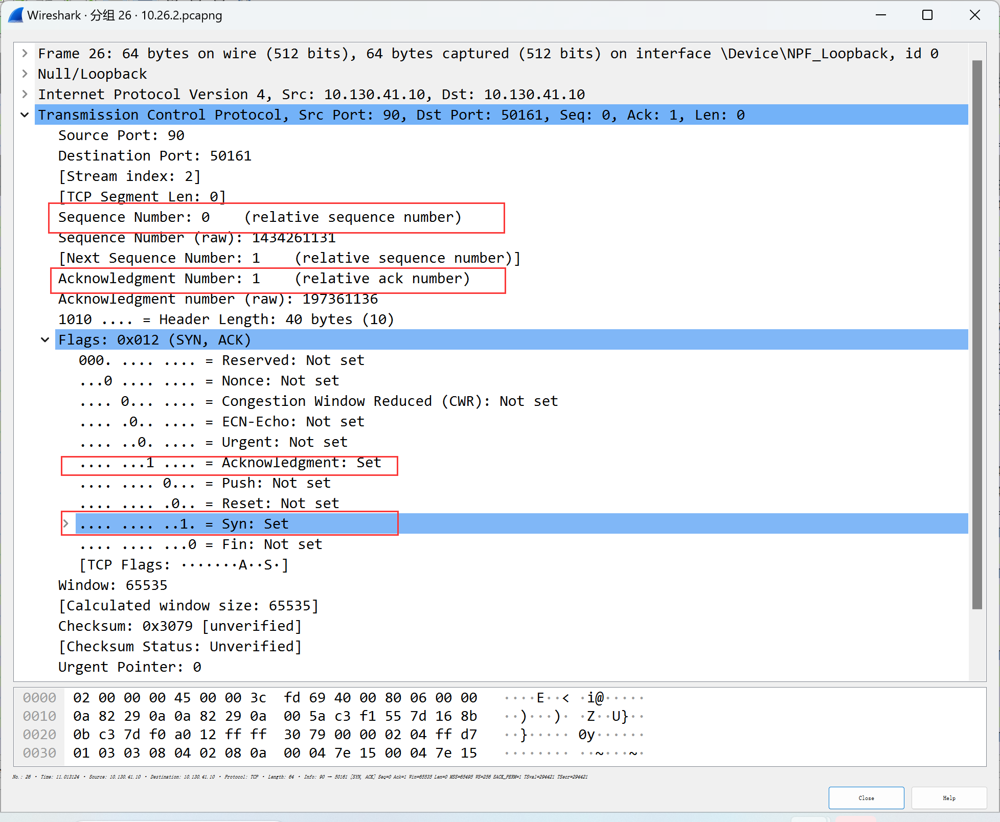

3. 第三次握手
   
   第三次握手([ACK], ACK = y + 1)
   客户端再次发送确认包(ACK),ACK = y + 1, 表示确认收到服务器的包（服务端发来的Seq值 + 1）。客户端发送完毕后，进入ESTABLISHED状态，服务端接收到这个包，也进入ESTABLISHED状态, TCP握手结束。
   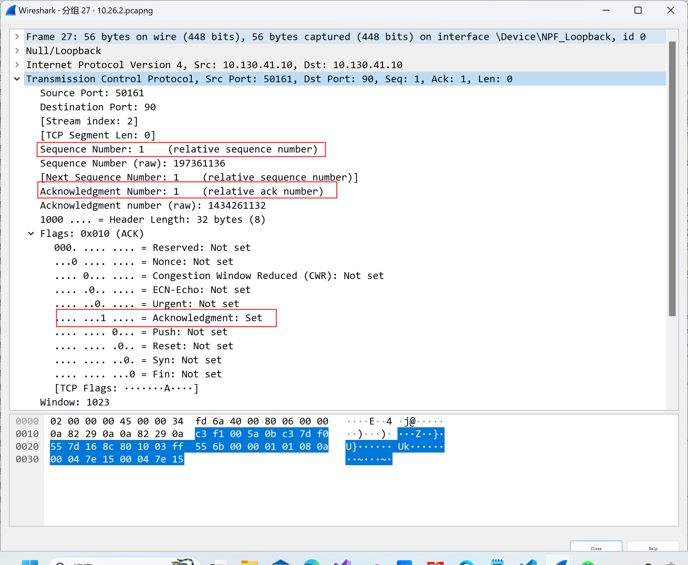

(2) http分析

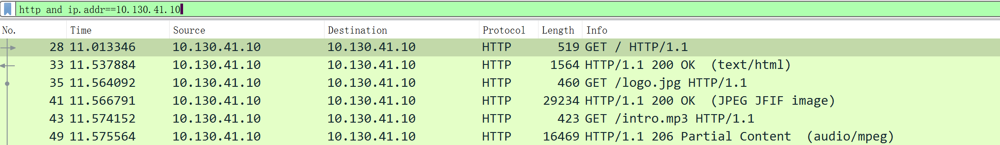

- 第一个HTTP是GET请求，获取HTML页面内容，HTTP/1.1 200 OK 表示HTTP请求已成功被服务器处理。在这个响应中，"200 OK" 表示服务器成功地响应了客户端的请求，并且返回了请求的资源或数据，在Line-based text data 中可以看到我写的 html 源码，：
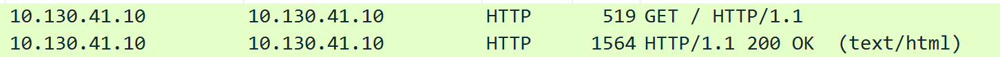
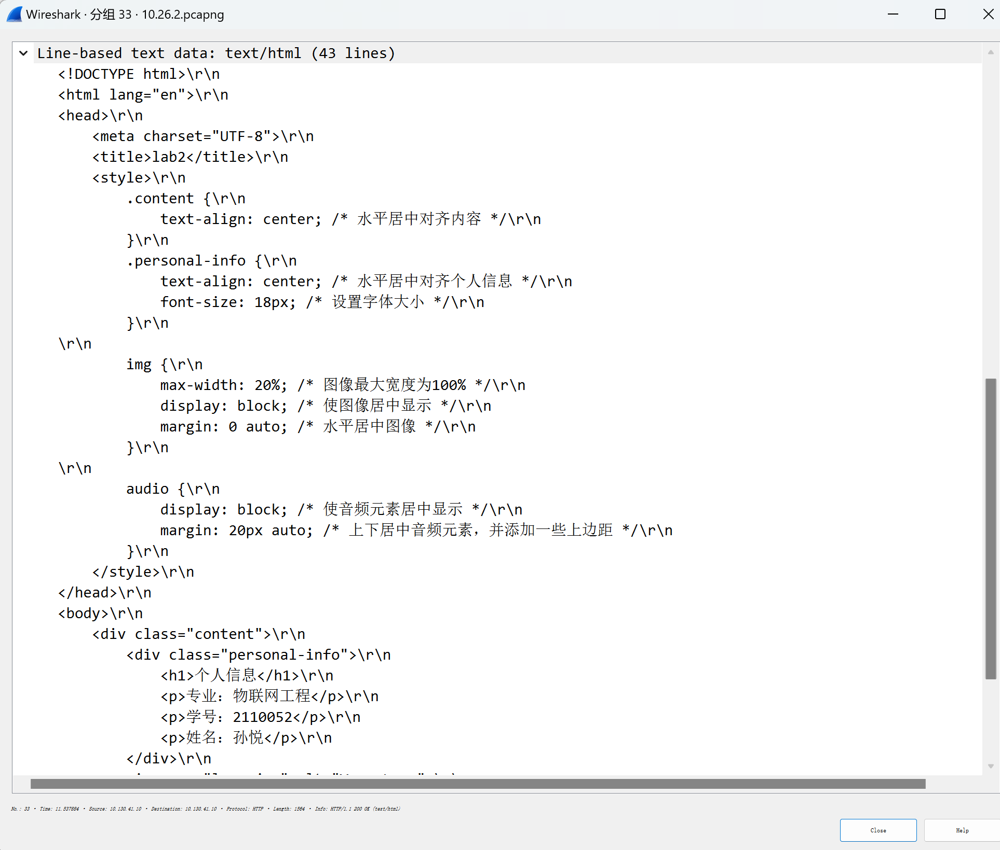

- 第二个HTTP的GET请求是获取服务器的图片logo.jpg, 200 OK 说明服务器成功响应并返回请求的图片,在 JPEG File Interchange Format 中我们可以看到图片的十六进制编码:
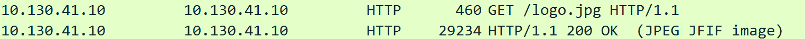
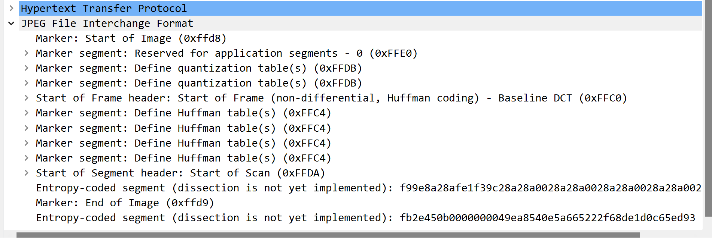

- 第三个HTTP的GET请求是获取服务器音频，206 Partial Content(audio/mpeg)说明请求成功响应并返回请求的音频，
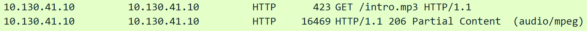

- 第四个和第五个是GET请求favicon.ico资源，由于我的服务器没有这个资源，所以返回404 Not Found的状态码：
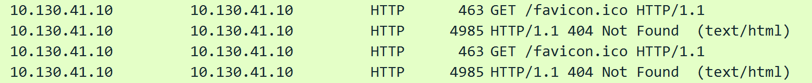

实验过程中出现的三种不同 HTTP 响应状态码：
1. 状态码 200
OK：请求成功，一般用于 GET 与 POST 请求。

2. 状态码 304（出现过但不是这次抓包）
Not Modified：未修改。所请求的资源未修改，服务器返回此状态码时，不会返回任何资源。客户端通常会缓存访问过的资源，通过提供一个头信息指出客户端希望只返回在指定日期之后修改的资源。

3. 状态码 404
Not Found：服务器无法根据客户端的请求找到资源（网页）。通过此代码，网站设计人员可设置” 您所请求的资源无法找到”或其他个性页面。

(3) TCP四次挥手
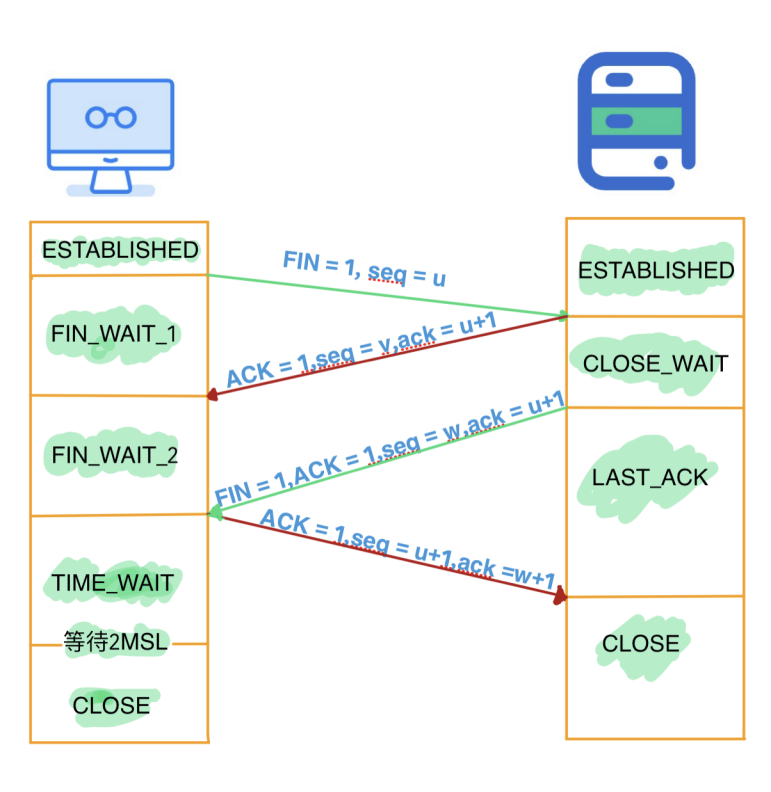
框出的是四次挥手：
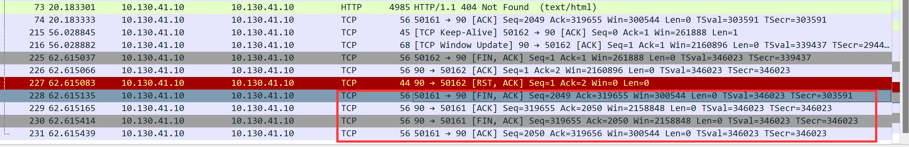

1. 第一次挥手（[FIN，ACK], Seq = u）
客户端发送一个FIN标记的包，告诉服务器需要关闭连接，表示自己不用发送数据了，但是还可以接收数据。发送完成后，客户端进FIN_WAIT_1状态。
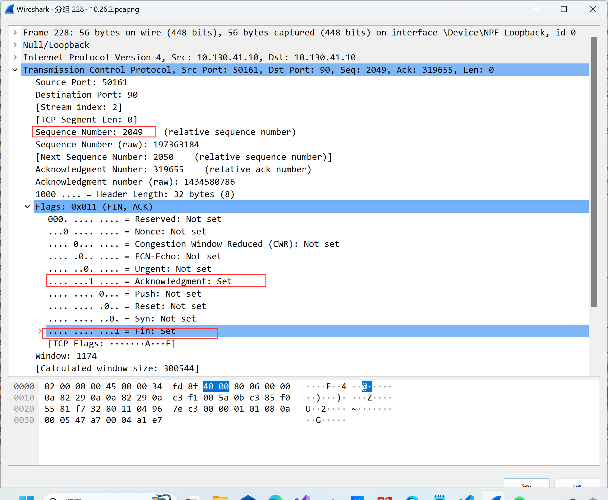
数据包的关键属性如下：
FIN = 1：表明这是一个 TCP 连接释放报文段；
ACK = 1：表明对之前收到的报文段进行确认；

2. 第二次挥手 ([ACK], ACK = u + 1, Seq = v)
服务端发送一个ACK的确认包，告诉客户端接收到关闭的请求，但是还没有准备好。发送完成后，服务端进入CLOSE_WAIT状态，客户端收到这个包后，进入FIN_WAIT_2，等待服务器关闭连接。
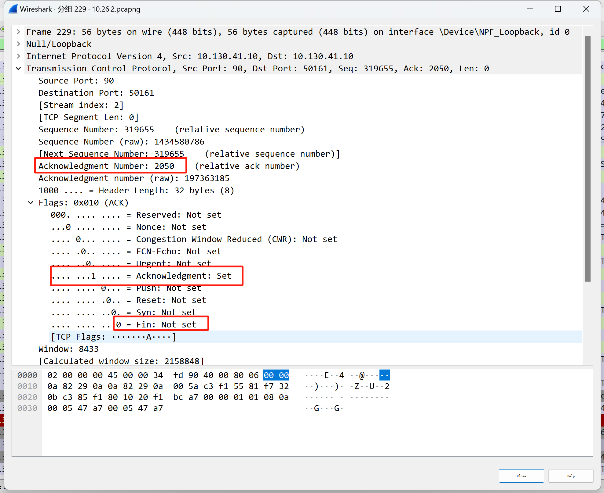
数据包的关键属性如下：
FIN = 0：表明在等待所有数据传输完成才能中断连接；
ACK = 1：表明回应客户端发来的请求

3. 第三次挥手 ([FIN，ACK], Seq = w, ACK = u + 1)
服务端准备好关闭连接时，发送FIN标记的包，告诉客户端准备关闭了。发送完成后，服务端进入LAST_ACK状态，等待客户端确认。
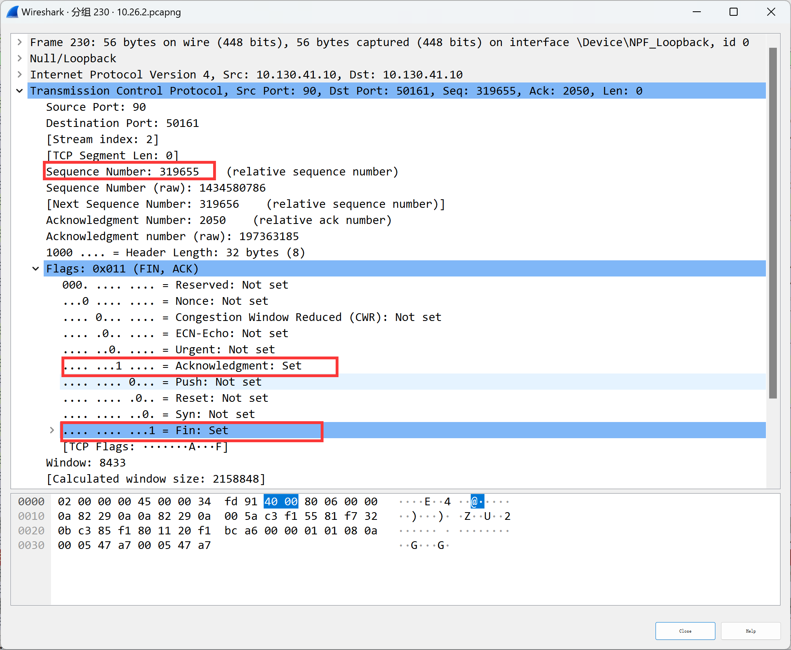
数据包的关键属性如下：
FIN = 1：服务器认为可以中断连接；
ACK = 1：回应客户端发来的请求；

4. 第四次挥手 ([ACK], ACK = w + 1)
客户端接收到服务端的关闭请求，再发送ACK标记的确认包，进入TIME_WAIT状态，等待服务端可能请求重传的ACK包。
服务端接收到ACK包后，关闭连接，进入CLOSED状态。
客户端在等待固定时间(两个最大段生命周期)后，没有接收到服务的ACK包，认为服务器已关闭连接，自己也关闭连接，进入CLOSED状态。
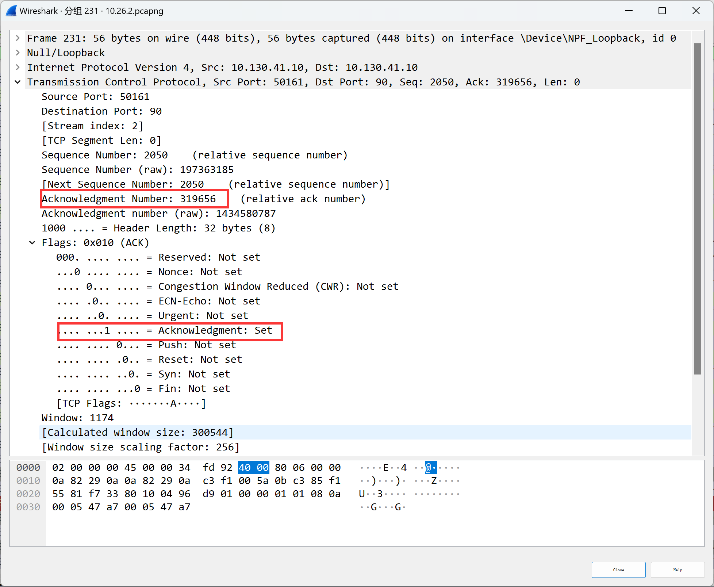
数据包的关键属性如下：
FIN = 0：不需要再次终止连接；
ACK = 1：回应服务器发来的请求；

### 五、实验总结
通过本次实验，我实现了 Web 服务器的设计并使用 html 进行优化，对服务器和 Wireshark 捕获的相关知识有了进一步的了解，更加细致地了解客户端与服务端的通信过程，加深了对三次握手、四次挥手等相关知识的理解。

